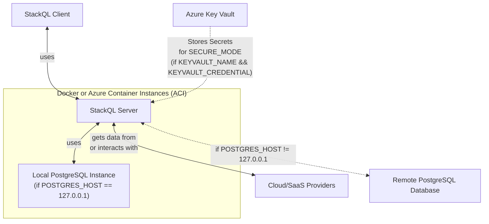

# StackQL Server with PostgreSQL Backend

# Table of Contents

1. [Architecture](#architecture)
2. [Deployment Options](#deployment-options)
   - [Container Deployment Modes](#container-deployment-modes)
   - [Database Configuration Modes](#database-configuration-modes)
   - [Client/Server Authentication Modes](#clientserver-authentication-modes)
3. [Authenticating to Cloud Providers](#authenticating-to-cloud-providers)
4. [Building the Container](#building-the-container)
4. [Running the Container](#running-the-container)
   - [Without mTLS (`SECURE_MODE=false`)](#without-mtls-secure_modefalse)
   - [With mTLS (`SECURE_MODE=true`)](#with-mtls-secure_modetrue)
5. [Running the Container in Azure Container Instances (ACI)](#running-the-container-in-azure-container-instances-aci)

## Architecture

The architecture consists of two primary components:

1. **StackQL Server**: A server that starts a [StackQL](https://github.com/stackql/stackql) server, accepting StackQL queries using the PostgreSQL wire protocol.
2. **PostgreSQL Server**: A backend database server used for relational algebra and temporary storage, particularly for materialized views.



## Deployment Options

The different deployment options are as follows:

### Container Deployment Modes
- **Deployment via ACI**: Leverages Azure Container Instances for scalable, cloud-native deployments.
- **Deployed using `docker run`**: Ideal for containerized environments, ensuring consistency and portability across different systems.

### Database Configuration Modes
- **Local DB Mode**: 
  - Activated when `POSTGRES_HOST` is set to `127.0.0.1` (default).
  - Runs a local, embedded PostgreSQL backend database.
- **Remote DB Mode**: 
  - Triggered when `POSTGRES_HOST` is set to any value other than `127.0.0.1`.
  - Connects to an externally hosted PostgreSQL database.

### Client/Server Authentication Modes
- **mTLS Authentication**:
  - Enabled by setting `SECURE_MODE=true` (default is `false`).
  - Utilizes mutual TLS (mTLS) for enhanced security in communications.
- **Keys and Certificates**:
  - Can be directly copied into the container.
  - Alternatively, sourced from Azure Key Vault if `KEYVAULT_NAME` and `KEYVAULT_CREDENTIAL` are provided.

## Authenticating to Cloud Providers

Populate the necessary environment variables to authenticate with your specific cloud providers. For more information on which environment variables to populate, see the [StackQL provider registry](https://github.com/stackql/stackql-provider-registry) documentation.

## Building the Container

**To build:**
```bash
docker build --no-cache -t stackql-server .
```

## Running the Container

### Without mTLS (`SECURE_MODE=false`)

**To run locally:**
```bash
# Use -e to supply provider credentials as needed (GitHub credentials used in this example)
docker run -d -p 7432:7432 \
-e STACKQL_GITHUB_USERNAME \
-e STACKQL_GITHUB_PASSWORD \
stackql-server

# or if using the Dockerhub image...
docker run -d -p 7432:7432 \
-e STACKQL_GITHUB_USERNAME \
-e STACKQL_GITHUB_PASSWORD \
stackql/stackql-server
```

**Connecting to the server:**
```bash
export PGSSLMODE=allow # or disable
psql -h localhost -p 7432 -U stackql -d stackql
```

**To stop the container:**
```bash
docker stop $(docker ps -a -q --filter ancestor=stackql-server)

# or if using the Dockerhub image...

docker stop $(docker ps -a -q --filter ancestor=stackql/stackql-server)
```

### With mTLS (`SECURE_MODE=true`)

**To prepare certificates and keys:**
```bash
# Follow these steps to generate Root CA, Server Cert, and Client Cert
openssl req -x509 -keyout creds/server_key.pem -out creds/server_cert.pem -config creds/openssl.cnf -days 365
openssl req -x509 -keyout creds/client_key.pem -out creds/client_cert.pem -config creds/openssl.cnf -days 365
chmod 400 creds/client_key.pem
```

**To run locally:**
```bash
docker run -d -p 7432:7432 \
-e STACKQL_GITHUB_USERNAME \
-e STACKQL_GITHUB_PASSWORD \
-e SECURE_MODE=true -v $(pwd)/creds:/opt/stackql/srv/credentials \
stackql-server
```

**Or using Dockerhub image:**
```bash
# Use -e to supply provider credentials as needed (GitHub credentials used in this example)
docker run -d -p 7432:7432 \
-e STACKQL_GITHUB_USERNAME \
-e STACKQL_GITHUB_PASSWORD \
-e SECURE_MODE=true -v $(pwd)/creds:/opt/stackql/srv/credentials \
stackql/stackql-server
```

**Connecting to the Secure Server:**
```bash
export PGSSLCERT=creds/client_cert.pem
export PGSSLKEY=creds/client_key.pem
export PGSSLROOTCERT=creds/server_cert.pem
export PGSSLMODE=require
psql -h localhost -p 7432 -d stackql
```

## Running the Container in Azure Container Instances (ACI)

To deploy the container in Azure Container Instances (ACI) using an image from Docker Hub, you can follow these steps:

1. **Create Key Vault (AKV) and Set Secrets:**
If you're using Azure Key Vault for storing secrets, replace the values with your specific details.

a. **Create a Key Vault:**

```bash
# create keyvault
az keyvault create --name stackqlkv --resource-group stackql-activity-monitor-rg --location eastus
```

b. **Create a Service Principal:**
```bash
# create service principal
APP_ID=$(az ad sp create-for-rbac --name stackqlsp --skip-assignment --query "appId" -o tsv)
```
This command will output JSON with `appId`, `displayName`, `password`, and `tenant`. The `password` field is the static credential you can use as a secret (`KEYVAULT_CREDENTIAL`).

c. **Assign the Service Principal Access to the Key Vault:**
```bash
# assign access to keyvault
az keyvault set-policy --name stackqlkv --spn $APP_ID --secret-permissions get list
```

d. **Create Secrets in the Key Vault:**
```bash
# Create secret for stackql server cert
az keyvault secret set \
--vault-name stackqlkv \
--name stackql-server-cert \
--value "$(cat creds/server_cert.pem)" > /dev/null

# Create secret for stackql server key
az keyvault secret set \
--vault-name stackqlkv \
--name stackql-server-key \
--value "$(cat creds/server_key.pem)" > /dev/null

# Create secret for stackql client cert
az keyvault secret set \
--vault-name stackqlkv \
--name stackql-client-cert \
--value "$(cat creds/client_cert.pem)" > /dev/null
```

2. **Create an Azure Container Instance:**
To create an instance, use the Azure CLI. Replace values for `name`, `resource-group`, and `dns-name-label` with your specific details. The `--dns-name-label` should be a unique DNS name for the ACI.
```bash
SERVER_CERT=$(base64 -w 0 creds/server_cert.pem)
SERVER_KEY=$(base64 -w 0 creds/server_key.pem)
CLIENT_CERT=$(base64 -w 0 creds/client_cert.pem)

az container create \
--name stackqlserver \
--resource-group stackql-activity-monitor-rg \
--image docker.io/stackql/stackql-server:latest \
--dns-name-label stackql \
--ports 7432 \
--protocol TCP \
--environment-variables \
SECURE_MODE=true \
SERVER_CERT=$SERVER_CERT \
SERVER_KEY=$SERVER_KEY \
CLIENT_CERT=$CLIENT_CERT
```
Make sure to replace the environment variable values with the ones you need for your setup.

3. **Retrieve the Fully Qualified Domain Name (FQDN) of the ACI:**
After the ACI is successfully deployed, retrieve its FQDN:
```bash
az container show \
--name stackqlserver \
--resource-group stackql-activity-monitor-rg \
--query ipAddress.fqdn \
--output tsv
```
This FQDN is used to connect to your StackQL server.

4. **Connect to the Server:**
Use the FQDN obtained above to connect to your StackQL server using a PostgreSQL client:
```bash
psql -h stackql.eastus.azurecontainer.io -p 7432 -U stackql -d stackql
```
For connections over mTLS, ensure that the client machine has the necessary client certificates configured, for example:

```bash
export PGSSLCERT=creds/client_cert.pem
export PGSSLKEY=creds/client_key.pem
export PGSSLROOTCERT=creds/server_cert.pem
export PGSSLMODE=require
psql -h stackql.eastus.azurecontainer.io -p 7432 -d stackql
```

5. **Monitor the Container Instance:**

To quickly check the logs of your container instance, you can use the Azure CLI:
```bash
az container logs \
--resource-group stackql-activity-monitor-rg \
--name stackqlserver
```
This command retrieves the logs produced by the container.

6. **Delete the Container Instance:**

To delete the container instance, use the Azure CLI:
```bash
az container delete \
--resource-group stackql-activity-monitor-rg \
--name stackqlserver
```