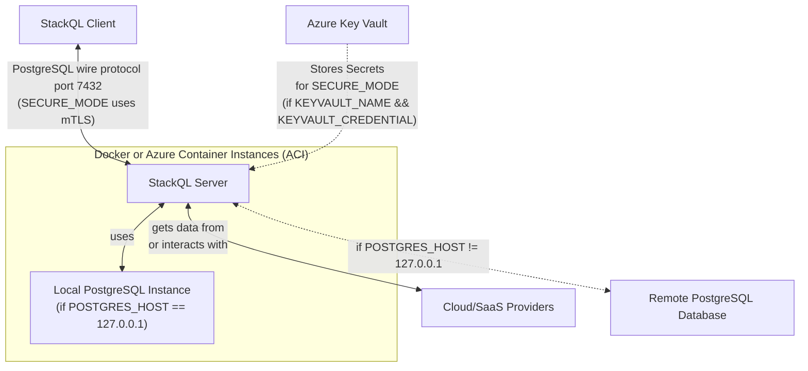

# StackQL Server with PostgreSQL Backend

# Table of Contents

1. [Architecture](#architecture)
2. [Deployment Options](#deployment-options)
   - [Container Deployment Modes](#container-deployment-modes)
   - [Database Configuration Modes](#database-configuration-modes)
   - [Client/Server Authentication Modes](#clientserver-authentication-modes)
3. [Authenticating to Cloud Providers](#authenticating-to-cloud-providers)
4. [Building and Running the Container](#building-and-running-the-container)
   - [Without mTLS (`SECURE_MODE=false`)](#without-mtls-secure_modefalse)
   - [With mTLS (`SECURE_MODE=true`)](#with-mtls-secure_modetrue)
5. [Running the Container in Azure Container Instances (ACI)](#running-the-container-in-azure-container-instances-aci)
   - [Push Image to Azure Container Registry (ACR)](#push-image-to-azure-container-registry-acr)
   - [Start ACI Container](#start-aci-container)
   - [Set Secrets in Azure Key Vault (AKV)](#set-secrets-in-azure-key-vault-akv)
   - [Retrieve Certificates using KEYVAULT_NAME and KEYVAULT_CREDENTIAL](#retrieve-certificates-using-keyvault_name-and-keyvault_credential)
   - [Getting Fully Qualified Domain Name (FQDN) of the ACI](#getting-fully-qualified-domain-name-fqdn-of-the-aci)
   - [Connecting to the Server](#connecting-to-the-server-2)

## Architecture

The architecture consists of two primary components:

1. **StackQL Server**: A server that starts a [StackQL](https://github.com/stackql/stackql) server, accepting StackQL queries using the PostgreSQL wire protocol.
2. **PostgreSQL Server**: A backend database server used for relational algebra and temporary storage, particularly for materialized views.



## Deployment Options

The different deployment options are as follows:

### Container Deployment Modes
- **Deployment via ACI**: Leverages Azure Container Instances for scalable, cloud-native deployments.
- **Deployed using `docker run`**: Ideal for containerized environments, ensuring consistency and portability across different systems.

### Database Configuration Modes
- **Local DB Mode**: 
  - Activated when `POSTGRES_HOST` is set to `127.0.0.1` (default).
  - Runs a local, embedded PostgreSQL backend database.
- **Remote DB Mode**: 
  - Triggered when `POSTGRES_HOST` is set to any value other than `127.0.0.1`.
  - Connects to an externally hosted PostgreSQL database.

### Client/Server Authentication Modes
- **mTLS Authentication**:
  - Enabled by setting `SECURE_MODE=true` (default is `false`).
  - Utilizes mutual TLS (mTLS) for enhanced security in communications.
- **Keys and Certificates**:
  - Can be directly copied into the container.
  - Alternatively, sourced from Azure Key Vault if `KEYVAULT_NAME` and `KEYVAULT_CREDENTIAL` are provided.

## Authenticating to Cloud Providers

Populate the necessary environment variables to authenticate with your specific cloud providers. For more information on which environment variables to populate, see the [StackQL provider registry](https://github.com/stackql/stackql-provider-registry) documentation.

## Building and Running the Container

### Without mTLS (`SECURE_MODE=false`)

**To build and run locally:**
```bash
docker build --no-cache -t stackql-server .
# Use -e to supply provider credentials as needed (GitHub credentials used in this example)
docker run -d -p 7432:7432 \
-e STACKQL_GITHUB_USERNAME \
-e STACKQL_GITHUB_PASSWORD \
stackql-server
```

**To stop the container:**
```bash
docker stop $(docker ps -a -q --filter ancestor=stackql-server --format="{{.ID}}")
```

**To run from the Dockerhub image:**
```bash
# Use -e to supply provider credentials as needed (GitHub credentials used in this example)
docker run -d -p 7432:7432 \
-e STACKQL_GITHUB_USERNAME \
-e STACKQL_GITHUB_PASSWORD \
stackql/stackql-server
```

**To stop the container:**
```bash
docker stop $(docker ps -a -q --filter ancestor=stackql/stackql-server --format="{{.ID}}")
```

**Connecting to the server:**
```bash
psql -h localhost -p 7432 -U stackql -d stackql
```

### With mTLS (`SECURE_MODE=true`)

**To prepare certificates and keys:**
```bash
# Follow these steps to generate Root CA, Server Cert, and Client Cert
[Instructions for certificate generation here]
```

**To build and run locally:**
```bash
docker build --no-cache -t stackql-server .
# Use -e to supply provider credentials as needed (GitHub credentials used in this example)
docker run -d -p 7432:7432 \
-e STACKQL_GITHUB_USERNAME \
-e STACKQL_GITHUB_PASSWORD \
-e SECURE_MODE=true -v $(pwd)/creds:/opt/stackql/srv/credentials \
stackql-server
```

**Or using Dockerhub image:**
```bash
# Use -e to supply provider credentials as needed (GitHub credentials used in this example)
docker run -d -p 7432:7432 \
-e STACKQL_GITHUB_USERNAME \
-e STACKQL_GITHUB_PASSWORD \
-e SECURE_MODE=true -v $(pwd)/creds:/opt/stackql/srv/credentials \
stackql/stackql-server
```

**Connect to the server:**
```bash
psql "sslmode=verify-ca sslrootcert=creds/ca.crt \
sslcert=creds/client.crt sslkey=creds/client.key \
host=localhost port=7432 user=stackql dbname=stackql"
```

## Running the Container in Azure Container Instances (ACI)

### Steps to deploy:

1. **Push Image to Azure Container Registry (ACR):**
   - [Instructions for pushing image to ACR]
2. **Start ACI Container:**
   - [Instructions to start ACI container]
3. **Set Secrets in Azure Key Vault (AKV):**
   - [Instructions to set secrets in AKV]
4. **Use KEYVAULT_NAME and KEYVAULT_CREDENTIAL to Retrieve Certificates:**
   - [Instructions for retrieving certs using Key Vault credentials]
5. **Get Fully Qualified Domain Name (FQDN) of the ACI:**
   - [Instructions to get FQDN]
6. **Connect to the Server:**
   - [Instructions for server connection]
