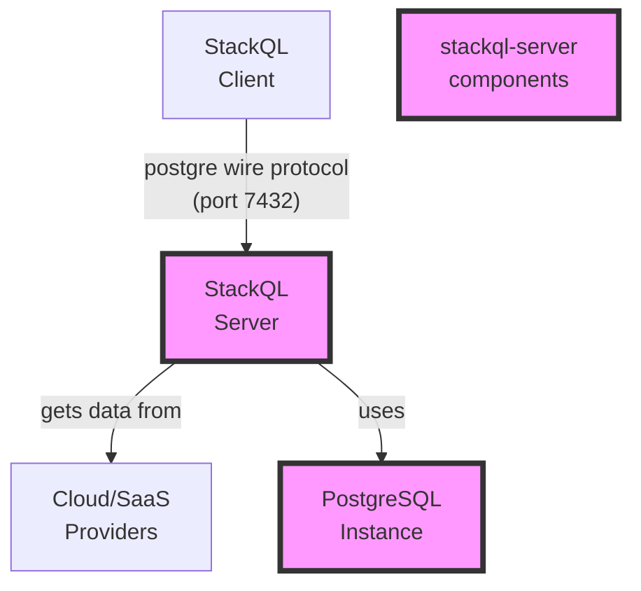

# StackQL Server with PostgreSQL Backend

## Architecture

The architecture involves two primary components:

1. **StackQL Server**: This server starts a [__`stackql`__](https://github.com/stackql/stackql) server accepting stackql queries using the PostgreSQL wire protocol.
2. **PostgreSQL Server**: Backend database server used for relational algebra and temporary storage (for materalized views).



## Running the Container

To run the container, execute the following command:

```bash
docker build --no-cache -t stackql_postgres .
docker run -d -p 7432:7432 stackql_postgres
```

## Submitting a Query to the StackQL Server

To submit a query to the StackQL server using `psql`, use the following command:

```bash
psql -h localhost -p 7432 -U stackql -d stackql
```

