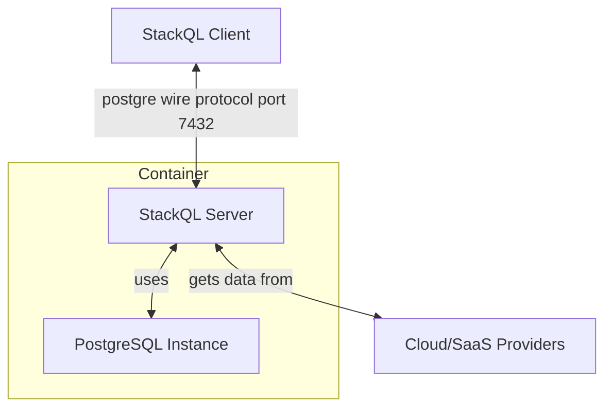

# StackQL Server with PostgreSQL Backend

## Architecture

The architecture involves two primary components:

1. **StackQL Server**: This server starts a [__`stackql`__](https://github.com/stackql/stackql) server accepting stackql queries using the PostgreSQL wire protocol.
2. **PostgreSQL Server**: Backend database server used for relational algebra and temporary storage (for materalized views).



## Authenticating to Cloud Providers

Populate the necessary environment variables to authenticate to your specific cloud providers.  For more information on which environment variables to populate, see the [__`stackql provider registry`__](https://github.com/stackql/stackql-provider-registry) documentation.

## Running the Container from the DockerHub Image

To run the container, execute the following command:

```bash
# use -e to supply provider creds as needed
# github creds are used in this example
docker run -d -p 7432:7432 \
-e STACKQL_GITHUB_USERNAME \
-e STACKQL_GITHUB_PASSWORD \
stackql/stackql-server
```

## Building and Running the Container

To run the container, execute the following command:

```bash
docker build --no-cache -t stackql-server .
# use -e to supply provider creds as needed
# github creds are used in this example
docker run -d -p 7432:7432 \
-e STACKQL_GITHUB_USERNAME \
-e STACKQL_GITHUB_PASSWORD \
stackql-server
```

## Connecting to the StackQL Server

To submit a query to the StackQL server using `psql`, use the following command:

```bash
psql -h localhost -p 7432 -U stackql -d stackql
```

## Pull a Provider and Run a Query

With the `stackql-server` running on port `7432`, you can pull a provider and run a query.  Having populated credentials for the `github` provider as an example in the previous code block, you can now pull the `github` provider and run a query, as shown here:

```bash
$ psql -h localhost -p 7432 -U stackql -d stackql
psql (14.9 (Ubuntu 14.9-0ubuntu0.22.04.1), server 0.0.0)
Type "help" for help.

stackql=> registry pull github;
OK

stackql=> select 
JSON_EXTRACT(v.value, '$.count') as count,
JSON_EXTRACT(v.value, '$.uniques') as uniques,
JSON_EXTRACT(v.value, '$.timestamp') as date
from github.repos.view_traffic, json_array_elements_text(views) v
WHERE owner = 'stackql' AND repo = 'stackql'
ORDER BY date ASC;
 count | uniques |         date
-------+---------+----------------------
 43    | 7       | 2023-11-18T00:00:00Z
 121   | 9       | 2023-11-19T00:00:00Z
 74    | 8       | 2023-11-20T00:00:00Z
 64    | 7       | 2023-11-21T00:00:00Z
 87    | 17      | 2023-11-22T00:00:00Z
 85    | 9       | 2023-11-23T00:00:00Z
 41    | 6       | 2023-11-24T00:00:00Z
 55    | 6       | 2023-11-25T00:00:00Z
 228   | 24      | 2023-11-26T00:00:00Z
 137   | 13      | 2023-11-27T00:00:00Z
 46    | 7       | 2023-11-28T00:00:00Z
 41    | 9       | 2023-11-29T00:00:00Z
 44    | 7       | 2023-11-30T00:00:00Z
 101   | 19      | 2023-12-01T00:00:00Z
 42    | 9       | 2023-12-02T00:00:00Z
(15 rows)

stackql=>
```